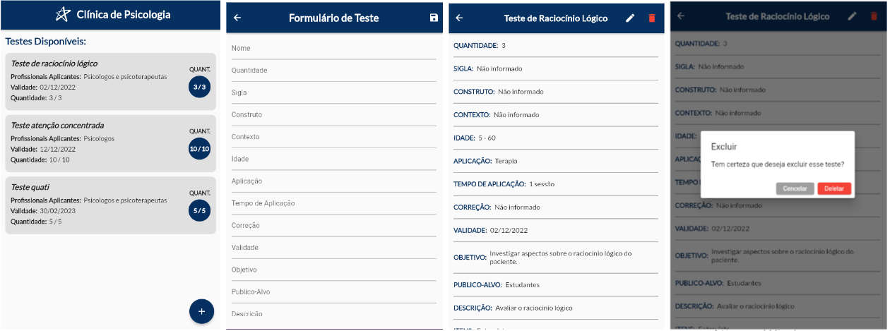
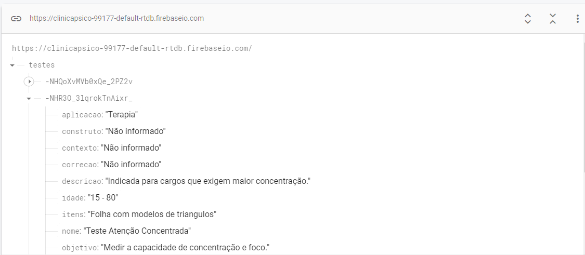

# Trabalho Desenvolvimento de Aplicativos Móveis 

## 2º bimestre 

Trabalho desenvolvido em sala de aula em parceria com o curso de Psicologia.  

## Alunos: 
- Eduarda Garangau Miranda
- Julio Cesar Jubel Lopes
- Lucas Eduardo Rocha da Silva
- Ruan Vinicius Horstmann dos Santos
- Isabelly de Oliveira Brasileiro 
- Isabela Borges de Miranda Gomes
- Júlia Ferreira de Castro 

## Fotos do Aplicativo: 

## Integração com Firebase: 
[Firebase Link](https://clinicapsico-99177-default-rtdb.firebaseio.com/)

